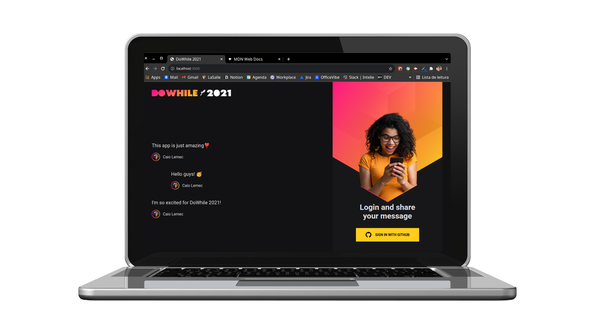

<h1 align="center">
    
</h1>
<br>
<p align="center">
  <a href="#desktop_computer-project"></a>&nbsp;
  <a href="#nail_care-layout"></a>&nbsp;
  <a href="#technologist-technologies"></a>
  <a href="#octocat-environment"></a>&nbsp;
  <a href="#bookmark_tabs-license"></a>&nbsp;
</p>

<p align="center">
 
</p>
<hr>

## :desktop_computer: Project

Application created in [@Rocketseat's](https://github.com/Rocketseat) seventh edition of NextLevelWeek, an online event that occurred on june 18th and 19th, 2021.

In this application it was possible to deepen knowledge in frontend and backend development, reviewing concepts like: 

I was able to learn a lot about:

- NodeJs,
- Prisma,
- Axios,
- ReactJS,
- much more...

>`Alert 1:` Due to some features in the styling, it is not recommended use olders browsers.

>`Alert 2:` The project doesn't have a responsive version.

## :nail_care: Layout
<p align="center">

You can also see <a href="https://www.figma.com/file/aKQ0S3cPv22nAvlgUpFrh9/%5BNLW-Heat---Mission%3A-Impulse%5D-DoWhile2021-(Community)?node-id=0%3A1">Figma</a> layout.
</p>

</p>
<hr>

## :technologist: Technologies

- [React](https://pt-br.reactjs.org/)
- [Node.js](https://nodejs.org/en/)
- [Typescript](https://www.typescriptlang.org/)
- [Axios](https://axios-http.com/docs/intro)
- [Prisma](https://www.prisma.io/)
<hr>

## :octocat: Environment

Keep in mind that the following installations will be needed:

- [Git](https://git-scm.com/book/pt-br/v2/Come%C3%A7ando-Instalando-o-Git)
- [Yarn](https://classic.yarnpkg.com/en/docs/install/#debian-stable)

Follow the instructions to run the application:

1. Clone the repository: 
```bash 
git@github.com:CaioLemec/page_messages.git
```
2. Open a terminal for each folder:
```bash 
cd ./Backend and cd ./Frontend
```
3. In the project root (backend), find and rename exemple.env to .env following inside instructions:
```bash
Follow the instructions inside to fill the environment variables.
```
4. For each terminal set this command line, to get all dependencies installed.
```bash
 yarn   
 ```
5. For each terminal set this command line, to run de project:
```bash
yarn dev
```
6. Access backend:
```bash
http://localhost:4000/
```
7. Access frontend:
```bash
http://localhost:3000/
```
<hr>

## :bookmark_tabs: License

Licensed under MIT [LICENSE](./LICENSE.md).

<hr>

I am available for any clarification. 🥰
    

<h3>Caio Lemec<h3>
<a href="https://t.me/caiolemec">
<a href="mailto:caiolemec@gmail.com">
<a href="https://www.linkedin.com/in/caiolemec/">
<br>
</p>
